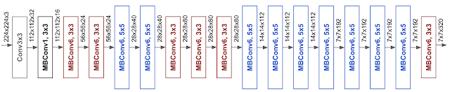

EfficientNet is a convolutional neural network architecture designed to achieve state-of-the-art performance while minimizing computational resources. The paper introduces a compound scaling method to balance model depth, width, and resolution, enabling efficient scaling for convolution networks. By optimizing the trade-off between model size and accuracy, the network was constructed based on a mobile-size baseline while still achieving higher performance with significantly fewer parameters.

## Private Investigator

|              Mingxing Tan             |    Quoc V. Le   |
|:--------------------------------------|:------------------|
| ||
| Staff Software Engineer at Google Brain [1](#ref1)    |Research Scientist at Google Brain|
| Cornell University|PhD at Standford|
| Peking University|Bachelor’s degree in Computer Science at The Australian National University|
||Was a researcher at NICTA and Max Planck Institute|

[2](#ref2)

## Rethinking Model Scaling for Convolutional Neural Networks

### Previous works

### Compound Scaling

#### Width
#### Depth
#### Resolution

### EffientNet
#### Neural Architecture Search (NAS)

## Academic Researcher

Drawbacks of EfficientNet
-	Training with very large image sizes is slow: 
As the model's substantial memory usage requires smaller batch sizes to fit within the fixed GPU/TPU memory constraints, resulting in a significant slowdown during training.

-	Depthwise convolutions are slow in early layers but effective in later stages
-	Problem from extensive depthwise convolutions (Sifre, 2014).
-	Equally scaling up every stage is sub-optimal
Beause EfficientNet equally scales up all stages using a simple compound scaling rule. For instance, when the depth coefficient is set to 2, every stage in the network doubles the number of layers, which may not be the most efficient approach.

=>	New way to search and scaling

## Societal Impact

Positive impact
-	Widespread accessibility and resource efficiency
Since the network was built based on mobile-size baseline requirements and less parameter compared to previous proposed convolution network, it is suitable for deployment on a variety of mobile devices. This results in the increase of mobile AI applications. 

Negative impact/issues raised by the advancement of Image Recognition for example:
-	Inaccuracy: Humans rely on the result of the model in fields like healthcare is dangerous
-	Legal Consent: Apart from public datasets like ImageNet. Legal issues must be addressed before the use of the application.
-	Others: Fraud, Bias, Ethical consent

## References

[1] 'APPM Department Colloquium - Mingxing Tan' <a name="ref1">https://www.colorado.edu/amath/2021/02/26/appm-department-colloquium-mingxing-tan </a>

[2] 'Quoc V. Le' <a name="ref2">https://cs.stanford.edu/~quocle/ </a>

