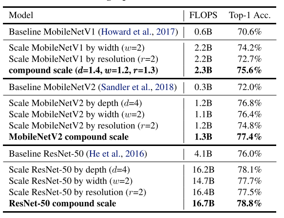
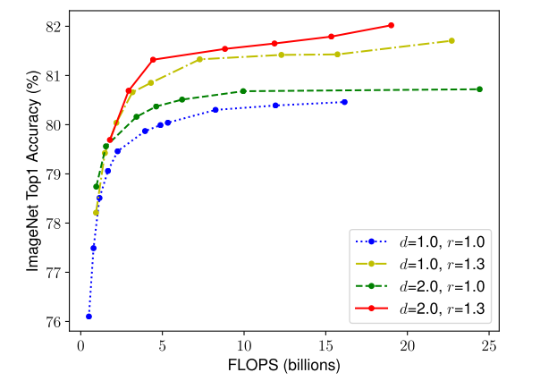
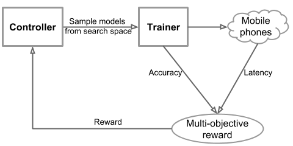
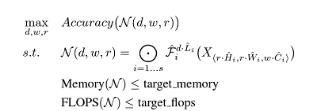

  

EfficientNet is a convolutional neural network architecture designed to achieve state-of-the-art performance while minimizing computational resources. The paper introduces a compound scaling method to balance model depth, width, and resolution, enabling efficient scaling for convolution networks. By optimizing the trade-off between model size and accuracy, the network was constructed based on a mobile-size baseline while still achieving higher performance with significantly fewer parameters.

## Private Investigator

|              Mingxing Tan             |    Quoc V. Le   |
|:--------------------------------------|:------------------|
| ||
| Staff Software Engineer at Google Brain [[1]](#ref1)    |Research Scientist at Google Brain|
| Postdoc at Cornell University|PhD at Standford|
| PhD at Peking University|Bachelor’s degree in Computer Science at The Australian National University|
||Was a researcher at NICTA and Max Planck Institute|

The paper's two authors were at Google Brain at the time of the publication.

Mingxing Tan received his PhD from Peking University. He was a postdoctoral researcher at Cornell University. Quoc V. Le finished his Bachelor’s in Computer Science at The Australian National University and his PhD at Sandford [[2]](#ref2). Le also worked as a researcher at NICTA and Max Planck Institute previously.

## Archeology

### Authors and Publication Date:

-   The EfficientNet paper, titled "EfficientNet: Rethinking Model Scaling for Convolutional Neural Networks," was indeed published in 2019 by Mingxing Tan and Quoc V. Le from Google.

### Context in the Timeline:

 [[4]](#ref4)

-   EfficientNet fits into the broader context of the evolution of image classification models, particularly in the race to achieve better efficiency without compromising accuracy. It builds upon the advancements of notable models such as AlexNet (2012), ResNet (2016), and MobileNetV2 (2018).

### Scaling Strategies:

-   The paper introduces a novel approach to scaling Convolutional Neural Networks (ConvNets) by simultaneously scaling the network's depth, width, and resolution. This is in contrast to previous methods that focused on scaling only one of these dimensions. The three scaling dimensions are inspired by earlier works: depth scaling (He et al., 2016), width scaling (Zagoruyko & Komodakis, 2016), and resolution scaling (Huang et al., 2018).

### Grid Search for Efficient Scaling:

-   EfficientNet utilizes a grid search technique to efficiently tune the scaling coefficients for depth, width, and resolution. This process aims to find an optimal balance that maximizes performance while minimizing computational and memory overhead. This is a critical aspect of the model, as it addresses the challenge posed by the scaling law.

### Advantages of Efficient Scaling:
-   The EfficientNet model stands out for achieving superior performance with similar computational costs. Through a grid search for tuning, it identifies a scaling strategy that is faster, more parameter-efficient, and less memory-intensive, making significant strides in neural network efficiency.

## Visual Explaination (Digrammer section)
In this section we see a graph showing the accuracy to parameter plot of various model when compared to the EfficientNet models B0-B7

The graph above are the results of running the model of the ImageNet datasets, where we see that EfficientNet outperforms all the other model even after having significatly lower number of parameters than all the other models. In case of EfficientNet-B7 achieved new state of art with 84.4% top-1 accuracy outperforming the previous SOTA GPipe but being 8.4 times smaller and 6.1 times faster.

### How does this happen?
It happens with the two techniques explored in this paper compound scalling and neural architecture search

## Rethinking Model Scaling for Convolutional Neural Networks

### Compound Scaling

Before EfficientNets, ConvNets were typically scaled up by increasing only one dimension - depth, width or image resolution. EfficientNets introduced a compound scaling approach that uniformly scales all three dimensions - depth, width and input resolution - using fixed ratios to balance between them. This allows the network to capture more fine-grained patterns as the input image gets bigger. Compound scaling sets EfficientNets apart from prior works and performs better than arbitrary scaling, as seen in results on MobileNets and ResNets in the figure below. Intuitively, bigger input size needs more layers and channels to capture details. So compound scaling works by scaling up depth, width and resolution together in a principled way.

The experiments with compound scaling reveal an important insight - balancing all dimensions is key for maximizing accuracy under computational constraints. As the figure shows below, the highest gains come from increasing depth, input resolution and width together. When resolution is higher at 299x299 (r=1.3) versus 224x224 (r=1.0), scaling width leads to much greater accuracy improvement on a deeper base network (d=2.0), for the same FLOPS cost. Simply put, pushing only one dimension hits a scaling limit. With a bigger input image, more layers are needed to process the additional detail, and more channels to capture the richer patterns. The authors succinctly state it as: "In order to pursue better accuracy and efficiency, it is critical to balance all dimensions of network width, depth, and resolution during ConvNet scaling."

## Neural Architecture Search (NAS)

The authors went beyond simply applying compound scaling to existing architectures. They recognized that developing a new baseline model, optimized specifically for mobile applications, would better showcase the power of compound scaling. This led them to create the EfficientNet architecture using neural architecture search - identifying an efficient baseline model tailored for mobile devices rather than arbitrarily picking an off-the-shelf ConvNet. Starting from this specialized foundation allowed them to scale up EfficientNet most effectively. Neural Architecture Search (NAS) is an automated process to design neural network architectures. It iterates over the space of possible architectures, training child models and using their performance as a signal to guide the search towards increasingly better designs specialized for the problem at hand.

### MnasNet Approach

 [[3]](#ref3)

Mnasnet utilizes both model accuracy and latency as an objective function while constrainting an overly large latency. The pipeline allows the controller to defines multiple blocks of neural networks containing different hyper-parameters. Then a method based on reinforcement learning is employed to discover model architectures that effectively optimize the given objective function. In each iteration, the controller initiates the process by generating a set of models, sampling them through its RNN network by predicting a sequence of tokens.

### Neural Architecture Search for EfficientNets

A similar approach to MnasNet has been used to create EfficientNet-B0. While MnasNet uses actual latency measured from a mobile device, as the network does not bound to one hardware, EfficientNet uses FLOPS instead. The pipeline does the same processes as MnasNet with an objective function to maximize $ACC(m) \times [FLOP(m)/T]^w$.

where $w,d,r$ are coefficients for scaling network width, depth, and resolution. $\hat{F}, \hat{L}, \hat{H},\hat{W} ,\hat{C}$ are predefined parameters in baseline network.

## Scaling Efficient-B0 to get B1-B7

## Academic Researcher

Drawbacks of EfficientNet are mainly because of its training speed. Several points are raised to point out that EfficientNet could be more efficient.

-	Training with very large image sizes is slow: 
As the model's substantial memory usage requires smaller batch sizes to fit within the fixed GPU/TPU memory constraints, resulting in a significant slowdown during training.
-	Depthwise convolutions are slow in early layers but effective in later stages: Problem from extensive depthwise convolutions (Sifre, 2014).
-	Equally scaling up every stage is sub-optimal: Because EfficientNet equally scales up all stages using a simple compound scaling rule. For instance, when the depth coefficient is set to 2, every stage in the network doubles the number of layers, which may not be the most efficient approach.

By finding the new way to search and scale the network could make EfficientNet be faster and efficient.

## Industrial Applications

-   Computer vision applications: EfficientNet models have become very popular as pre-trained models for transfer learning in computer vision tasks like image classification, object detection, segmentation, and more. Their efficiency makes them well-suited for deployment in applications.

-   Mobile and embedded vision: Because EfficientNet models are smaller and computationally cheaper than previous state-of-the-art ConvNets like ResNet, they are very useful for deploying on mobile devices or embedded systems. This enables smart camera applications, drones, and mobile augmented reality systems.

-   Scalability to large datasets or number of classes: The scaling method used in EfficientNets allows them to scale up to larger datasets like ImageNet-21k (over 21,000 classes) while still maintaining greater efficiency than other models of similar performance. This makes them attractive for handling complex, large-scale vision tasks.

-   Model optimization and compression: EfficientNet's techniques like depthwise convolutions and model scaling based on a compound coefficient make the models highly optimizable for techniques like model quantization or pruning. This further improves efficiency when deploying the models.

## Societal Impact

EfficientNet is considered a small network suitable for embedding in mobile devices. As in the current smartphone era, integrating mobile computer vision has become pervasive, fundamentally reshaping the mobile phone market with a strong emphasis on AI and ML. EficientNet and all mobile computer vision technologies bring us two-sided impacts.

On the positive side, the mobile-sized baseline requirements and streamlined parameters in network construction enhance widespread accessibility and resource efficiency. It facilitates the deployment of AI applications across a diverse array of mobile devices, fostering an upsurge in the prevalence and accessibility of mobile-based AI applications.

The negative impacts of these advancements are manifold. First is the concern of inaccuracy, mainly when humans heavily rely on the outcomes of these models, particularly in sensitive fields like healthcare. Furthermore, legal consent becomes a critical issue, extending beyond widely used public datasets like ImageNet. Addressing legal intricacies seems imperative before such applications are widely deployed and used. Additionally, concerns surrounding fraud, bias, and ethical consent further underscore the intricate moral landscape accompanying the rapid evolution of mobile computer vision.

{:refdef: style="text-align: center;"}

{: refdef}

## Review by Pichaya Saittagaroon
### Overall:
8: Strong Accept. High-impact paper, with no major concerns with respect to evaluation, resources, reproducibility, or ethical considerations.
 
### Strengths and Weaknesses: 
-   Originality: The idea of scaling law and network resource optimization is not novel. However, the proposed scaling law and network combination show interesting findings and achieve high accuracy and performance. The related works are cited adequately.
-   Quality: The experiment results are well supported with widely known benchmarks. The paper may need to provide more details on how the network is constructed. The author should also have mentioned the evaluation of their work.
-   Clarity: The paper was well written, stating the background of the problem with easy-to-understand language. Previous works were introduced well and were easy to follow.
-   Significance: The finding results were intriguing. The network achieved high accuracy in many datasets. It also introduces the concept of using the network’s width, depth, and resolution together to scale.

## Review by Ashwin Sharan
### Overall:  
Technically strong paper with, with novel ideas, excellent impact on the field of computer vision in terms of classification, with excellent evaluation, resources, and reproducibility, and no unaddressed ethical considerations. (Score 8/10)

### Strengths and Weaknesses: 
-   Originality: The idea may not be completely novel as it tries to combine the findings of previous papers where scaling width, depth and resolution can help improve the model. But it is novel in its approach of combining all three to find a ratio that works best.
- 	Quality: The results of the experiments are well explained and are reproducible, It has significant data showing the improvements in the model due to its approach.
- 	Clarity: The mixed scaling approach is empirically motivated and there is no theoretical justification for the specific scaling factors used. But the paper provide significant exploration of different datasets 
-   Significance: EfficientNet is significantly more efficient than previous models, using fewer parameters and FLOPs. It achieves state-of-the-art accuracy on several image classification benchmarks.

## References

[0] Tan, M. and Le, Q. (2020.) EfficientNet: Rethinking Model Scaling for Convolutional Neural Networks. https://arxiv.org/abs/1905.11946

[1] APPM Department Colloquium - Mingxing Tan <a name="ref1">https://www.colorado.edu/amath/2021/02/26/appm-department-colloquium-mingxing-tan </a>

[2] Quoc V. Le <a name="ref2">https://cs.stanford.edu/~quocle/ </a>

[3] MnasNet: Towards Automating the Design of Mobile Machine Learning Models <a name="ref2">https://blog.research.google/2018/08/mnasnet-towards-automating-design-of.html</a>

[4] Wrapping Up CNN Models: Shifting Focus to Attention-Based Architectures https://blog.gopenai.com/wrapping-up-cnn-models-shifting-focus-to-attention-based-architectures-5029b87034d9